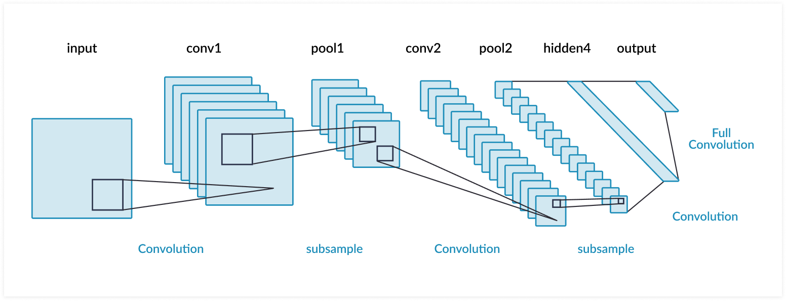

## CNN Summary  

1. CNN is used for classification task.
2. A filter is a matrix which has a particular feature.
3. **Step 1** : The filter is traversed(convolved) over the input image with a _stride_(size of jump over the pixels) to search for the feature.There can be multiple filters.
4. The output image of convolution are called _feature maps_.
5. **Step 2** : **Max pooling** i.e. taking max from grid and writing as one pixel value which is further passed to an **Activation function(ReLU)**.
6. **Step 3** : Feature maps are flattened to bring them into one single vector and that becomes the first layer of DNN.
7. **Step 4** : Output layer also called as classifier which classifies the output. _Softmax_ is mostly used for classification.
8. **Key Concepts**:
 * Kernel size: Size of sliding window in pixels. Small is better(1, 3 or 5).
 * Zero padding: The amount of zeros to put on the image border. It allows the kernel to completely filter every location of an input image, including the edges.
 * Number of filters: It decides the number of features that a convolution layer will search.
 * Flattening : Used to bring all feature maps matrices into a single vector.
