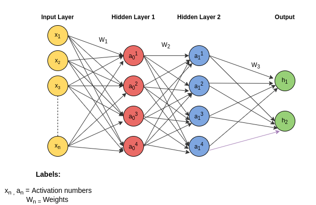

## DNN Summary

### What is Neural Network :
   
   
   1. Deep Neural Networks(NN) are motivated by biological NN but are much simpler.
   2. Knowledge gained through learning process by connections between neurons of different layers.
   3. Deep NN means NN having more than one layer. 
   4. Elements of NN:  
    * Nodes having activation value(between 0 and 1) which make up a layer.  
    * Connections to nodes of other layers having some weights(W).  
    * Adder for summation of weighted inputs. These two operations calculate the weighed sum of inputs.  
    * Non-linear activation function that limits output of neuron to in the interval (0,1).  
    * Activation functions: **Sigmoid**(old school), mostly used - **ReLU**(Rectified Linear Unit).  
    * Sigmoid formula = 1 / (1 + e^-x) where x is input(range is 0 to 1).  
    * ReLU formula = max(0, x) where x is input(range is 0 to infinity).  
   5. Each layer performs a task and passes the output as an input to the next layer.  
   6. _Bias_ tells how high the weighted sum need to be before neuron starts getting meaningfully active.  
   
### Gradient descent, how neural networks learn :
   1. _Gradient_ means slope and _descent_ means negative.
   2. It is the process of repeatedly changing an input of a function by multiple of the negative gradient.
   3. Cost value tells us how well the model performs(small value is better).
   4. Cost is calculated by :- add up square of difference between predicted and expected output.
   5. Gradient Descent(GD) is used to for minimizing the cost function.
   6. GD gives the direction to move and also the magnitude for the movement.
   7. NN learns structured data more quickly compared to unstructured data.
   
### What is backpropagation really doing : 
   1. It is the algorithm for determining how single training example would like to change weights and biases to decrease the cost.
   2. What really happens:  
    * The network makes a guess about data, using its parameters.  
    * The network is measured with a loss function.  
    * The error is backpropagated to adjust the wrong parameters.  
   3. Backpropagation takes the error associated with a wrong guess by NN, and uses that error to adjust the parameters in the direction of less error.  
